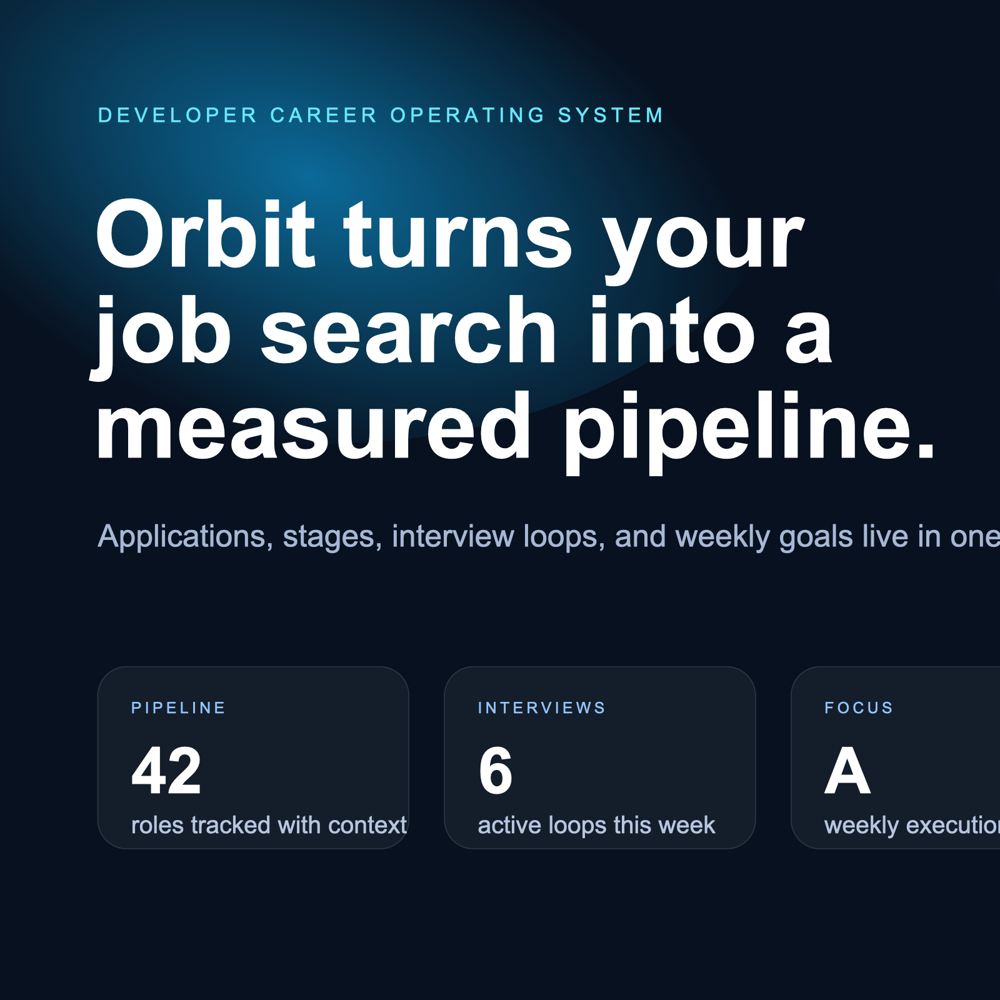
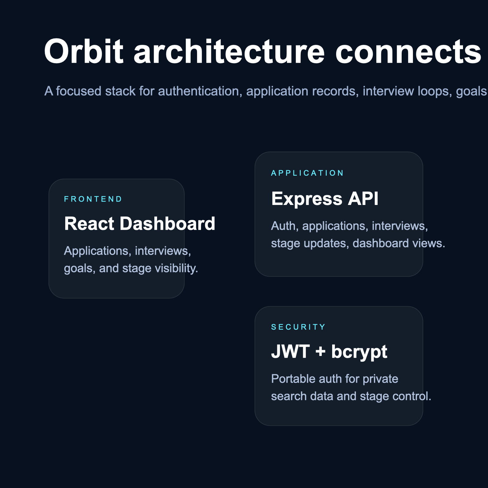

# Orbit Career Tracker

<p align="center">
  
</p>

<p align="center">
  
  
  
</p>

A full-stack career operating system for software engineers: track applications, stage changes, interviews, weekly goals, and pipeline health in a product-quality dashboard instead of a spreadsheet graveyard.

## Visual aesthetic
Orbit uses the same premium dark-product language as ambitious developer tools: cyan-violet gradients, glass surfaces, dense signal-rich cards, and portfolio-ready dashboard composition.

<p align="center">
  
</p>

## Feature set
- Email/password registration and login
- Application intake and pipeline tracking
- Stage transitions from applied to interviewing/offers
- Interview scheduling tied to real applications
- Goal tracking and stage distribution summary
- Responsive React dashboard with premium UI
- JSON persistence for zero-infra local demos
- Frontend and backend tests plus production builds

## Architecture
### Backend
- **Runtime:** Node.js 24
- **Framework:** Express + TypeScript
- **Security:** bcrypt password hashing + JWT auth
- **Persistence:** local JSON database optimized for demo portability
- **Domain:** applications, interviews, goals, and dashboard metrics

### Frontend
- **Runtime:** Vite + React + TypeScript
- **UX:** polished job-search command center
- **State:** local session persistence + typed request client
- **Flows:** registration, application creation, stage updates, interview scheduling

## Repository layout
```text
orbit-career-tracker/
├── backend/
├── web/
├── docs/assets/
├── docs/verification/
├── docker-compose.yml
├── LICENSE
└── README.md
```

## Run locally
### Backend
```bash
cd backend
npm install
npm run dev
```
API runs at `http://localhost:8090`.

### Frontend
```bash
cd web
npm install
npm run dev -- --host 127.0.0.1 --port 5174
```
Web runs at `http://localhost:5174`.

## Verification evidence
Local verification completed on this machine. Public artifacts are available in `docs/verification/`:
- `orbit-landing-check.png` — initial unauthenticated landing screen capture
- `orbit-dashboard-live.png` — authenticated dashboard runtime capture
- `orbit-dashboard-full.png` — full-page dashboard capture with seeded application/interview data
- `runtime-verification.json` — redacted from the public repo because it contains sensitive live-session verification data
- `orbit.e2e.spec.ts` — browser automation spec used during verification fallback work

Verified locally:
- backend health endpoint responded successfully on `http://127.0.0.1:8090/api/health`
- frontend served successfully on `http://127.0.0.1:5174`
- backend tests passed
- frontend tests passed
- backend production build passed
- frontend production build passed

## Docker
Dockerfiles and `docker-compose.yml` are included for production-like packaging. Docker was not available in this environment during build verification, so the packaging files are authored but not executed here.

## License
MIT
